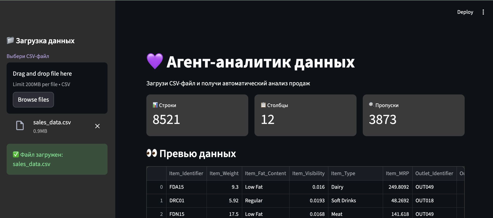
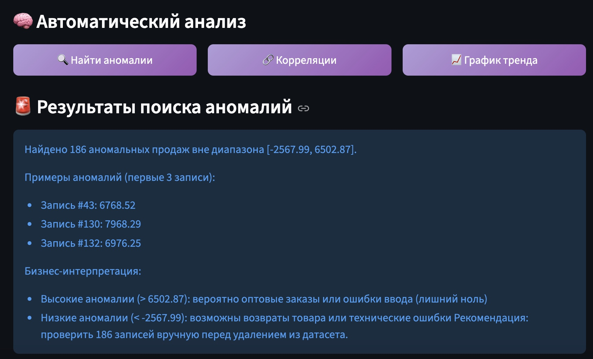
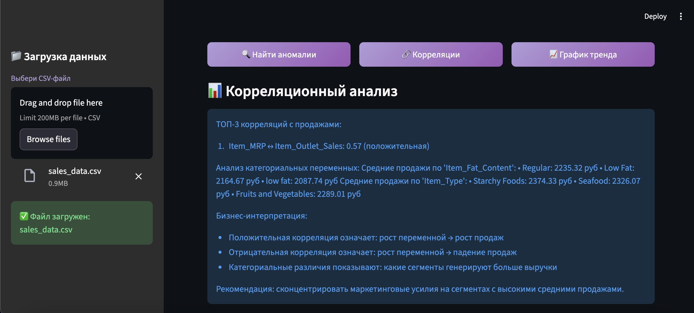
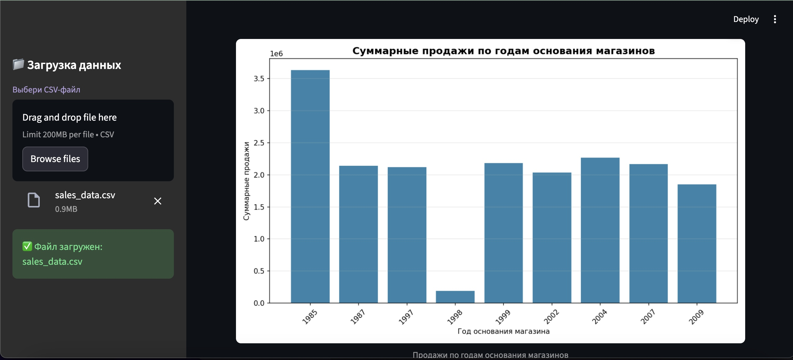

# 💜 Агент-аналитик данных

Многошаговый ИИ-агент для автоматического анализа табличных данных с поиском аномалий, корреляционным анализом и бизнес-интерпретацией.

[](https://www.python.org/downloads/)
[](https://streamlit.io)
[](https://langchain.com)
[](https://opensource.org/licenses/MIT)

[Смотреть 30-секундное демо](https://disk.yandex.ru/i/pgfYwo4mnT4sfA)

---

## 🌟 Возможности

| Функция | Результат |
|---------|-----------|
| 🔍 **Поиск аномалий** | 186 аномалий методом IQR + бизнес-классификация (оптовые заказы / ошибки ввода / возвраты) |
| 🔗 **Корреляционный анализ** | ТОП-3 корреляций + анализ категориальных признаков (например, `Item_MRP ↔ Sales: 0.57`) |
| 📈 **Визуализация** | График продаж по годам основания магазинов |
| 💼 **Бизнес-интерпретация** | Автоматические рекомендации без «воды» |
| 🎨 **Фиолетовая тема** | Единый тёмный фиолетовый дизайн с градиентными кнопками |

---

## 📹 Скриншоты

| Интерфейс | Аномалии | Корреляции | График |
|-----------|----------|------------|--------|
|  |  |  |  |

---

## 🚀 Как запустить

### Требования
- Python 3.12+
- Ollama с моделью `llama3.1:8b`

### Установка
```bash
# Установка Ollama
brew install ollama
ollama pull llama3.1:8b

# Запуск проекта
git clone https://github.com/kseniia-ditrih/ai-agent-analyst.git
cd ai-agent-analyst
python -m venv venv
source venv/bin/activate
pip install -r requirements.txt
streamlit run app.py
```

Приложение откроется по адресу `http://localhost:8501`.

---

## 💼 Бизнес-ценность

На датасете из **8521 записи** агент экономит аналитику **~5 часов работы**:

| Задача | Вручную | С агентом | Экономия |
|--------|---------|-----------|----------|
| Поиск аномалий | 3-4 часа | 10 сек | **99.9%** |
| Корреляционный анализ | 1-2 часа | 5 сек | **99.9%** |
| Визуализация | 30 мин | 3 сек | **99.8%** |

**Ключевые находки:**
- Корреляция **0.57** между ценой товара (`Item_MRP`) и продажами
- Разница в средних продажах по типам магазинов: до **70%**

---

## 🛠️ Технологии

| Компонент | Технология |
|-----------|------------|
| Языковая модель | Llama 3.1 8B (Ollama, локально) |
| Агент-фреймворк | LangChain + LangGraph |
| Веб-интерфейс | Streamlit (тёмная фиолетовая тема) |
| Анализ данных | Pandas, NumPy, Matplotlib |

**Архитектура:** Пользователь → Агент (планирование шагов) → Инструменты (`load_csv`, `find_outliers`, `correlation_analysis`, `plot_trend`) → Результат с бизнес-интерпретацией.

---

## 📚 Данные для теста

- [Sales Forecasting Dataset на Kaggle](https://www.kaggle.com/datasets/ameenhasan/sales-forecasting-dataset)

---

## 📄 Лицензия

MIT © Kseniia Nabatova